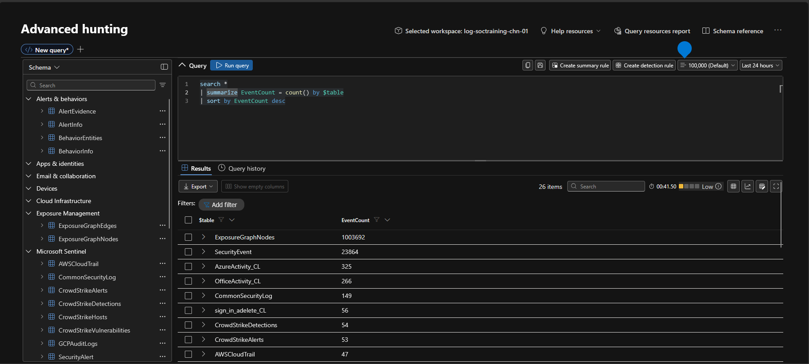
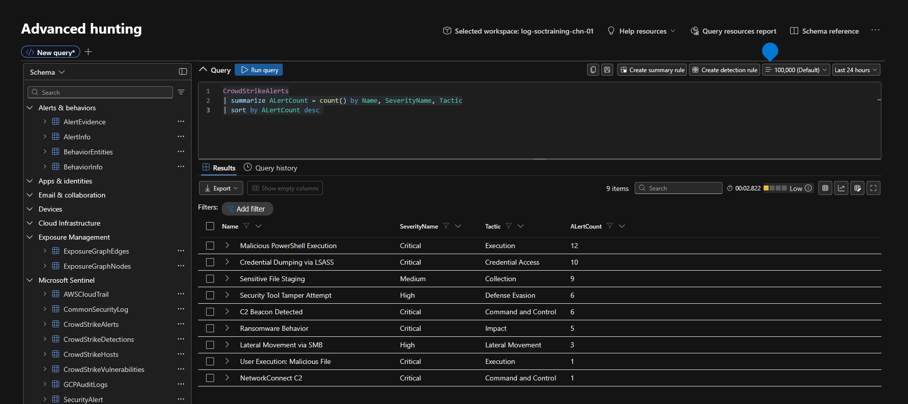
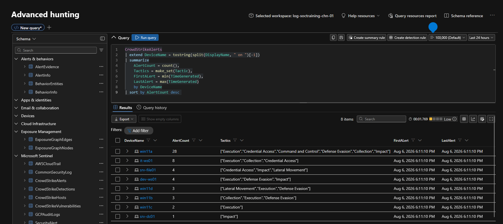
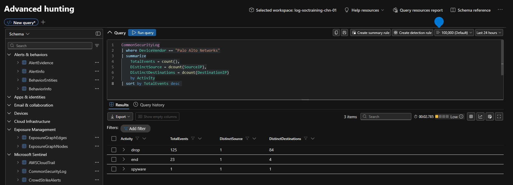
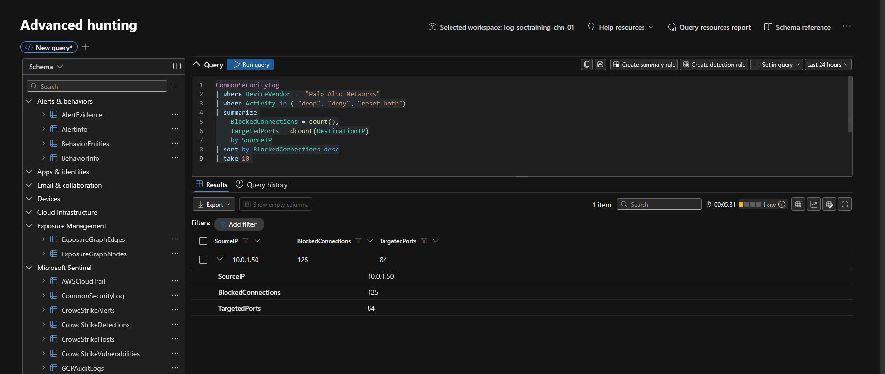
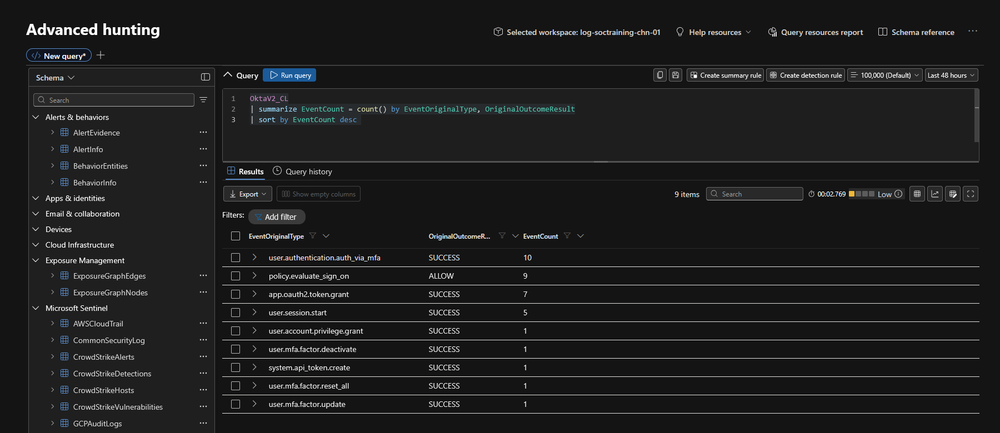
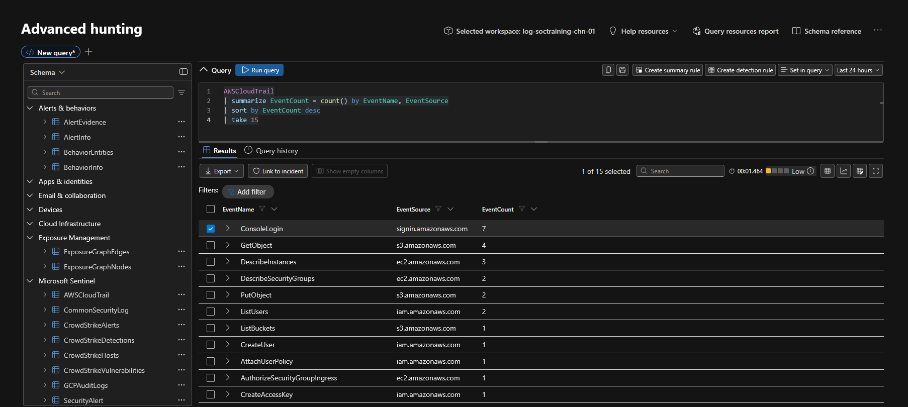
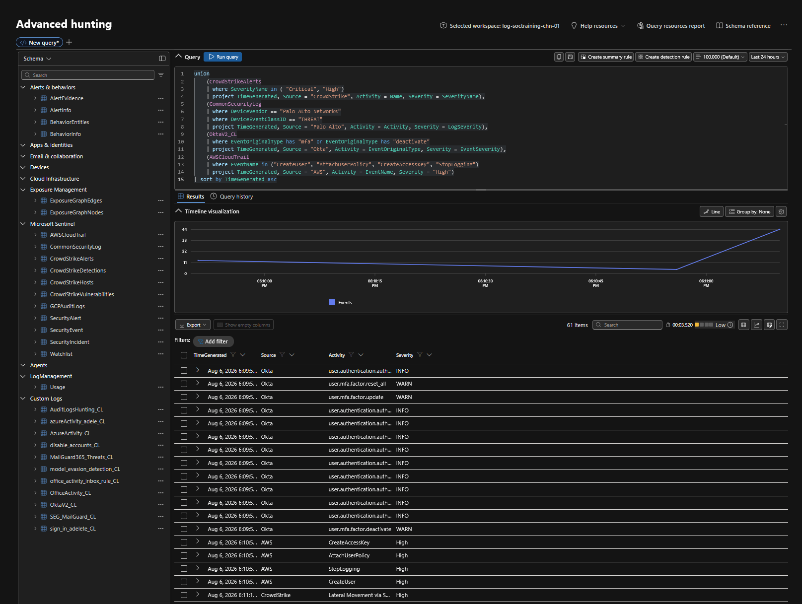
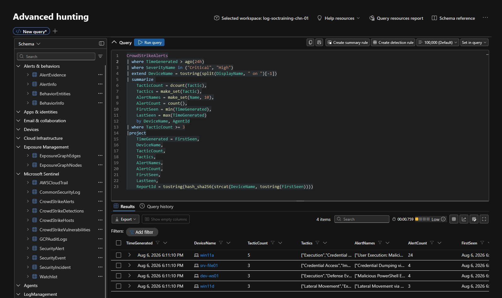
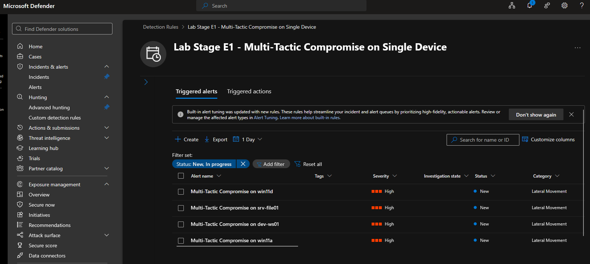

# Module 2, Exercise 1 — Exploration: Hunting Across Your Data

**SC-200 domain:** Perform threat hunting (20–25%), with a touch of "Manage a security operations environment" (40–45%) via the custom-detection-rule creation at the end — named explicitly in the current outline.
**Prerequisites:** `00-prerequisites-onboarding.md` complete, live telemetry confirmed.

---

## Summary

Advanced Hunting queries run against each ingested data source in turn — table discovery (`search *`), CrowdStrike endpoint alerts (type breakdown and per-device timeline), Palo Alto firewall traffic (totals and denied connections), Okta identity events (failed logins), AWS CloudTrail (API call patterns), and a cross-source `union` timeline. Closed with a detection query aggregating multi-tactic CrowdStrike activity per device, turned into a scheduled custom detection rule: `Lab Stage E1 - Multi-Tactic Compromise on Single Device`.

## Errors Encountered and Resolved

None — this exercise ran clean apart from one timing adjustment (below), a first after the extensive troubleshooting in Onboarding.

## Technical Know-How

> **`TimeGenerated` is fixed at ingestion time, not dynamic.** Queries using `ago()` windows (Steps 6–7 of this exercise) need that window sized against actual elapsed time since ingestion, not assumed to still be "just now." Ran this exercise with the detection query's window widened from the exercise's default 4h to 24h, to account for real time elapsed since Onboarding's ingestion — same logic, adjusted for reality.

> **The created rule doesn't map to one precise MITRE technique** — it's a **behavioral aggregation rule** (tactic diversity on a single device), not a single-technique signature. Mapped to Lateral Movement / T1021 as the closest conceptual fit, since the pattern it detects — a device pivoting across multiple attack stages — is textbook lateral-movement framing even though no single alert in the underlying data is itself a T1021 event. Worth remembering for the exam: precise technique-mapped rules and broader statistical/behavioral rules both get a MITRE tag, but the tag means something different for each.

## Key Learnings

- `search *` is the fastest way to inventory what's actually in a workspace before writing targeted queries.
- `summarize` with `dcount` surfaces patterns (distinct ports, IPs, tactics) that raw counts hide.
- `union` across heterogeneous tables (different schemas per source) works by projecting each branch into a common shape first — `Source`, `Activity`, `Severity` here.
- A solid detection rule pairs aggregation (`summarize`) with an explicit threshold (`where TacticCount >= 3`), not just a raw filter.
- Custom Detection rules require `TimeGenerated` and a `ReportId` in the query output — non-negotiable for the framework to accept the rule.

## Screenshots referenced

- Step 1, `search *` table overview

- Step 2, alert breakdown by name/severity/tactic

- Step 2, per-device alert timeline

- Step 3, firewall traffic overview

- Step 3, connections

- Step 4, login patterns

- Step 5, CloudTrail activity

- Step 6, unified timeline

- Step 7, widened-window detection query and results

- Step 9, rule run confirmation and triggered alert

---

**Deliverable status:** Complete.
