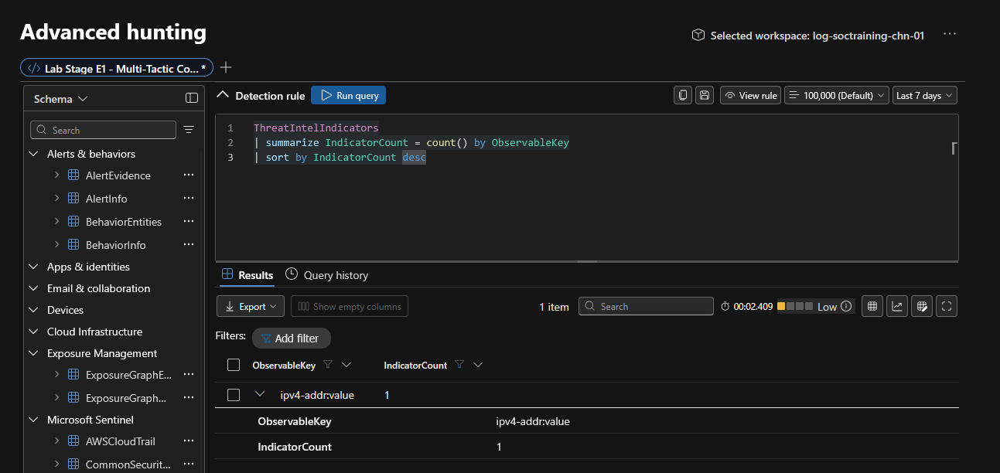
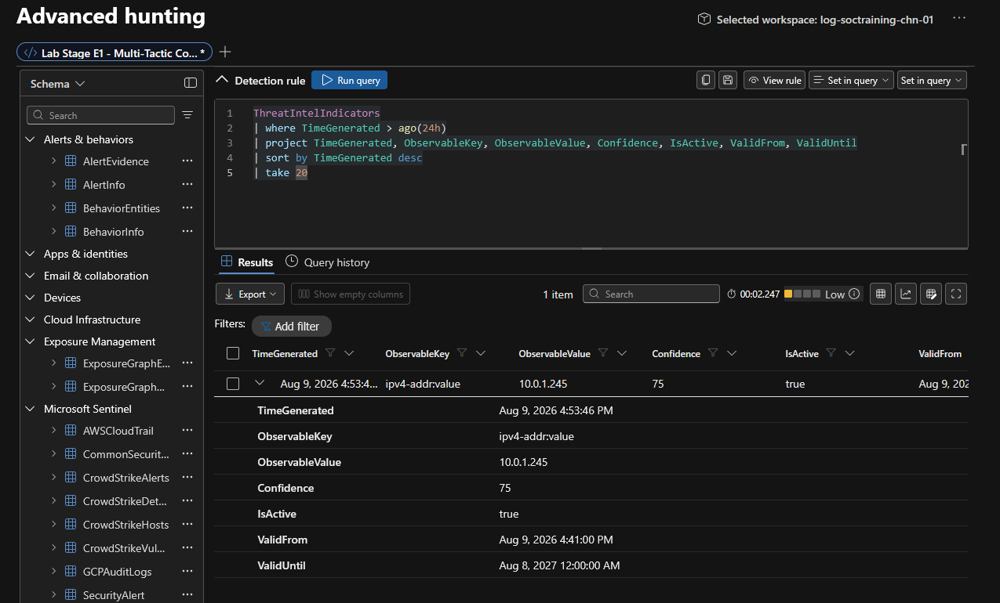
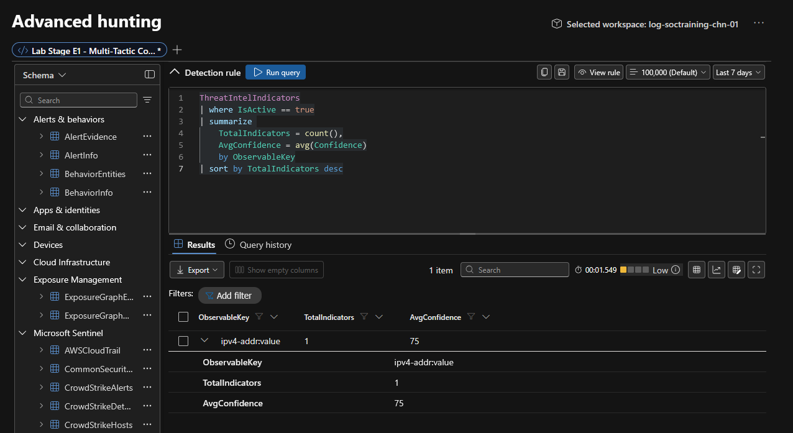
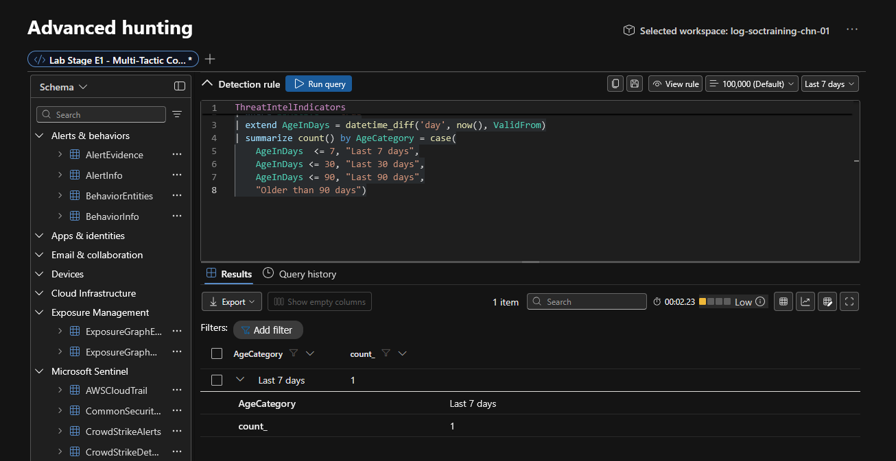
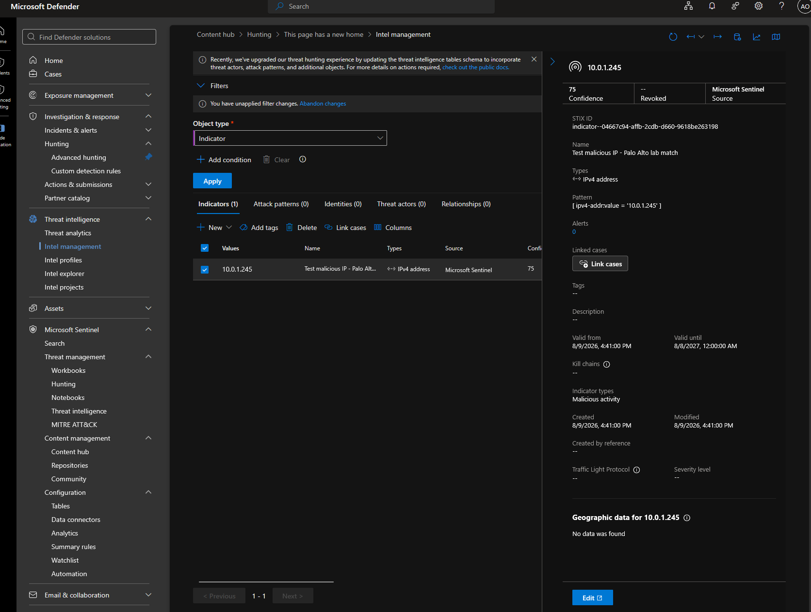
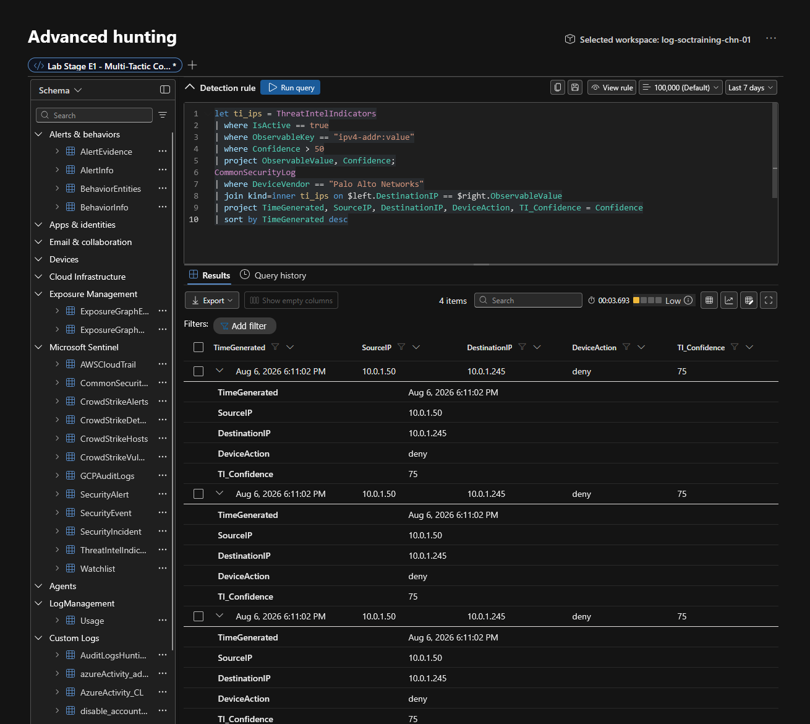

# Module 2, Exercise 2 — Threat Intelligence: Microsoft Defender Threat Intelligence

**SC-200 domain:** Manage a security operations environment (40–45%) — data connector/content hub setup; Perform threat hunting (20–25%) — TI indicator correlation via `join`.
**Prerequisites:** Exercise 1 complete.

---

## Summary

Attempted the native MDTI data connector as written; blocked by a Microsoft business-verification requirement not achievable on an individual/student subscription. Adapted by manually creating a threat intelligence indicator matching real values from ingested Palo Alto telemetry, and successfully demonstrated the TI-to-telemetry `join` pattern end to end — arguably a stronger artifact than the exercise's own expected (empty-by-design) outcome, since it shows a real match rather than a documented non-result.

## Errors Encountered and Resolved

**1. MDTI connector onboarding blocked by business verification.** Attempting to connect the MDTI data connector returned: *"The tenant is not approved for MicrosoftTi connector onboarding. Complete CFAR registration and retry"* — routing to `verification.microsoft.com`, Microsoft's business-verification portal (used across several Microsoft programs), requiring legal business registration documents. This is a structural eligibility gate, not a misconfiguration — not achievable for an individual student subscription, and not something to work around by entering fabricated business information. Most likely exists to prevent anonymous/individual harvesting of Microsoft's curated threat intelligence. Documented as a known access limitation, same category as the project's existing no-M365-E5 gap.

**2. Adapted via manual indicator creation.** Sentinel's Intel management blade supports adding TI objects directly, independent of any connector. Used this to seed one `ipv4-addr` indicator matching a real `DestinationIP` value pulled from the lab's own `CommonSecurityLog` (Palo Alto) telemetry, so the correlation query would have something genuine to match against rather than relying on the exercise's own "expected empty" fallback.

**3. Portal terminology shifted mid-exercise.** The "Threat intelligence" nav item now redirects to a page whose breadcrumb reads "This page has a new home," pointing at **Intel management**. The exercise's own written instructions and screenshots still reference the old naming — another instance of the platform's ongoing post-unification terminology churn, on top of the classic-portal retirement already documented in Onboarding.

**4. `Confidence` field defaults to "Is null."** The New TI object panel defaults the Confidence field to a checked "Is null" toggle rather than an explicit `0`. Left unchecked (i.e., left as null), the exercise's `where Confidence > 50` filter silently excludes the indicator — no error, just quietly no match. Must explicitly uncheck "Is null" and enter a real number.

**5. `ObservableKey` format mismatch between manual creation and the exercise's queries.** Even with Confidence correctly set to 75, the correlation join still returned empty. Pulling the raw stored row confirmed why: the manual-creation panel stores `ObservableKey` as the **full STIX property path** — `ipv4-addr:value` — not the bare observable type `ipv4-addr` the exercise's queries filter on. Fixed by matching the actual stored format:
   ```kql
   | where ObservableKey == "ipv4-addr:value"
   ```
   or, for a version resilient to either format (useful if a working MDTI connector is ever added later, whose data may use the bare form):
   ```kql
   | where ObservableKey has "ipv4-addr"
   ```

**6. Indicator wasn't immediately joinable after creation.** Even with the `ObservableKey` fix, the join returned empty on the first several attempts, then succeeded without any further change. Same pattern as the custom-table indexing lag from Exercise 1 — freshly created data (there, ingested rows; here, a manually created TI object) needs a short window before it's reliably queryable, not an indication the query or setup is wrong.

## Technical Know-How

> **Business verification (`verification.microsoft.com`) is a real, hard eligibility gate on some Microsoft data connectors** — worth knowing generally, not just for this lab. It requires genuine legal business registration documents and isn't something an individual account can complete. When a connector demands it, that's a program-eligibility boundary, not a support issue to troubleshoot around.

> **Manually created and connector-sourced TI indicators aren't guaranteed to share the same `ObservableKey` format** in this schema. When correlating TI data, inspect a raw sample row first (`take 10` with no filters) rather than assuming the exercise's documented key format matches what's actually stored — this was the single most time-consuming part of this exercise, and a raw sample would have shown it immediately.

> **Freshly written data — via ingestion or manual creation — has a short but real indexing lag before it's reliably queryable.** Seen now in two different contexts (Exercise 1's custom tables, this exercise's manual TI indicator). Worth a brief pause before concluding a query is broken when the data was *just* created.

## Key Learnings

- Always uncheck defaulted "Is null" toggles on numeric fields before relying on them in a downstream filter — a silent-exclusion trap, not an error.
- When a correlation/join query returns unexpectedly empty, check the raw source table first (unfiltered sample) before debugging the join logic — the mismatch is often in field format, not query syntax.
- A manually seeded indicator, deliberately matched against real ingested telemetry, is a more convincing demonstration of a TI-correlation pattern for a portfolio doc than an empty-by-design result — worth the extra few minutes when the option exists.

## Screenshots referenced

- Step 2, indicator ingestion/count verification





- Step 5, indicator statistics by type



- Step 5, indicator age distribution



- Step 6, Intel management blade overview



- the working Palo Alto correlation join, 4 matched rows, `TI_Confidence = 75`



---

**Deliverable status:** Complete.
