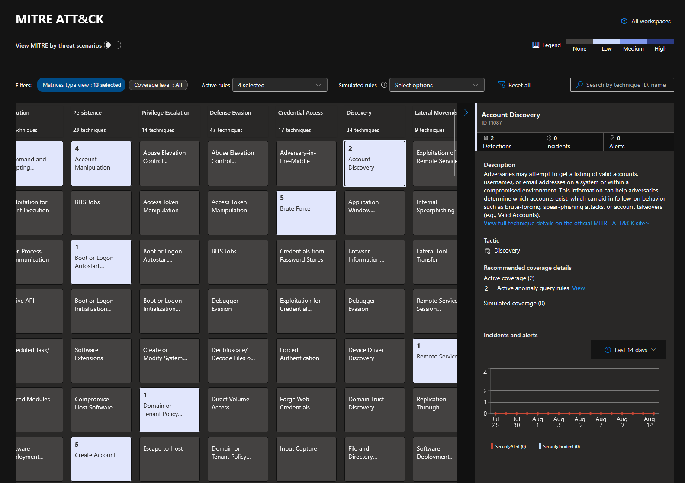
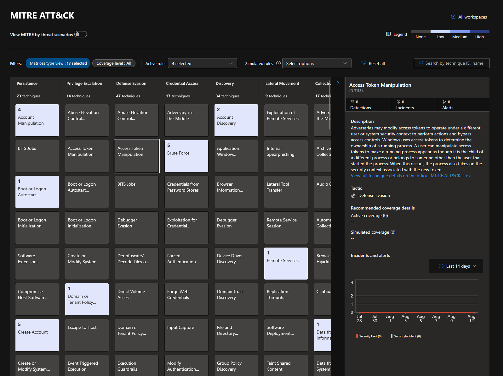
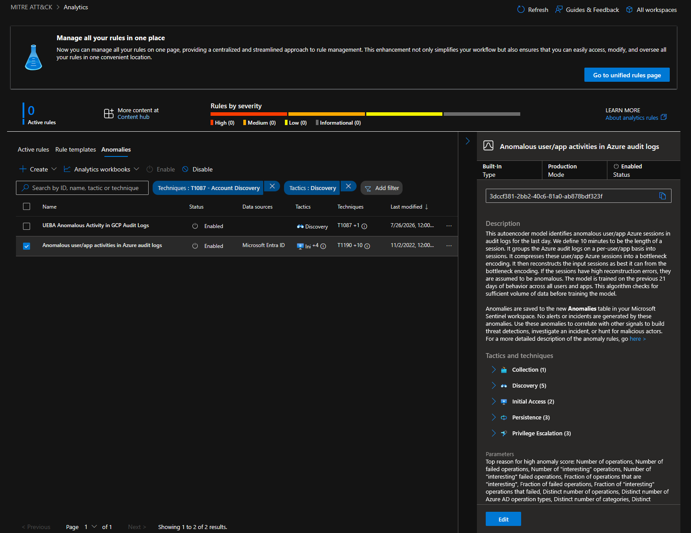
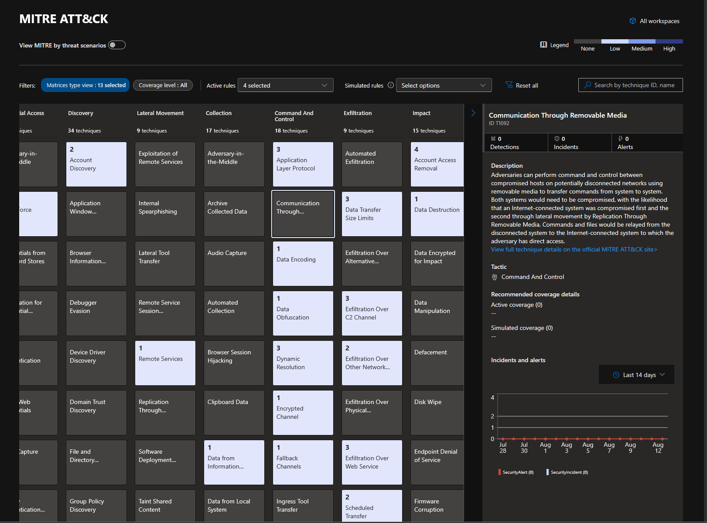
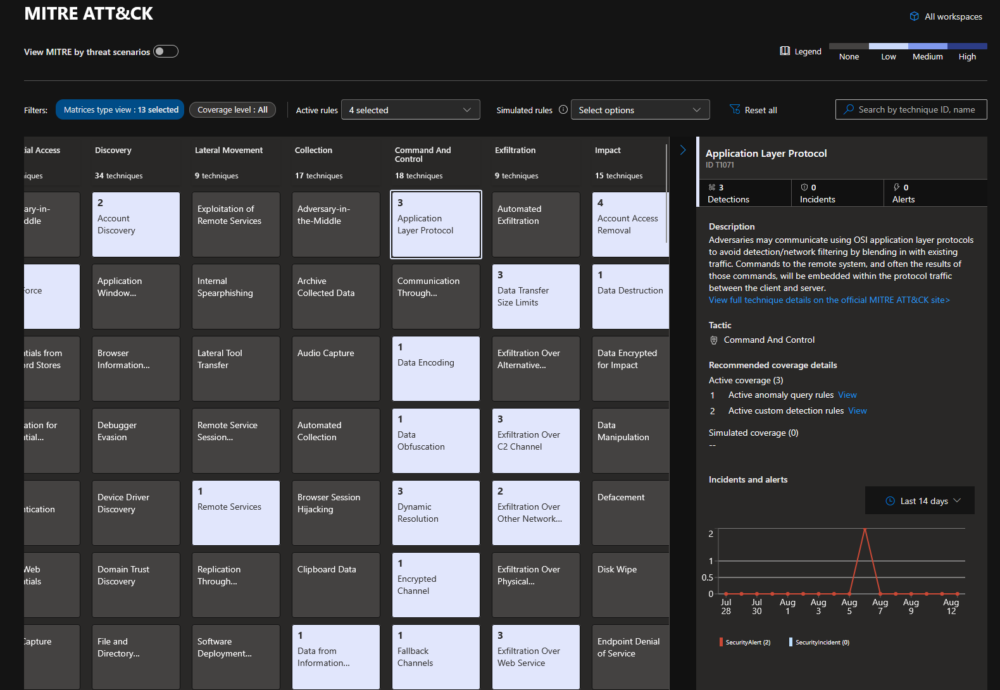

# Module 2, Exercise 3 — MITRE ATT&CK Coverage

**SC-200 domain:** Manage a security operations environment (40–45%) — the MITRE coverage blade and anomaly detection are both named explicitly in the current outline.
**Prerequisites:** Exercises 1–2 complete.

---

## Summary

Explored the Defender portal's MITRE ATT&CK coverage matrix: filtered to active rules, examined a covered technique and a genuine gap, then went deeper into an unplanned but valuable discovery — Microsoft's built-in ML-based anomaly detection rules contribute meaningful MITRE coverage independent of the 20 custom detection rules deployed in Onboarding, and a single technique's coverage is often a *mix* of both mechanisms at once.

## Initial Prediction, Corrected

Before starting, I (Claude) predicted **Command & Control** would show as an uncovered gap, based on the exercise's own reference table mapping T1071 exclusively to `Lab Stage S8` — one of the two rules deferred due to the Data Lake dependency (§Onboarding, known open items). This was wrong. Live inspection showed Command & Control well covered — `Application Layer Protocol: 3`, `Data Obfuscation: 3`, `Ingress Tool Transfer: 2`, `Scheduled Transfer: 2`, and more.

**Root cause of the wrong prediction:** the exercise's reference table describes one specific lab attack scenario's rule mapping — it was never meant to be a complete inventory of everything capable of contributing coverage to a tactic. Two things it doesn't account for: Microsoft's built-in anomaly rules (see below), and other deployed custom rules whose techniques weren't listed in that particular table (`Stage 5`, `Stage 5.5` — both genuinely C2-relevant, neither mentioned in the exercise's own reference table).

**Lesson, stated plainly:** don't treat a scenario write-up as a complete coverage map. Verify against the live matrix directly.

## Key findings

**1. Covered technique — Account Discovery (T1087), Discovery tactic.** Side panel showed coverage via **2 Active anomaly query rules** — not any of the 20 custom rules deployed in Onboarding.

**2. What those anomaly rules actually are.** Sentinel ships built-in ML-based anomaly detection rules, active in the workspace by default, entirely separate from scheduled analytics/custom detection rules. Inspected `Anomalous user/app activities in Azure audit logs`: an autoencoder model that groups Azure AD audit log activity into per-user/per-app sessions, compresses and reconstructs them, and flags high-reconstruction-error sessions as anomalous — trained on the trailing 21 days of behavior across all users and apps. This single rule alone maps across five tactics (Collection, Discovery, Initial Access, Persistence, Privilege Escalation).

**3. Genuine gap — Communication Through Removable Media (T1092), Command and Control tactic.** Confirmed `Active coverage (0)`, `Simulated coverage (0)` — and correctly so: none of the ingested telemetry sources (CrowdStrike, Palo Alto, Okta, AWS, GCP) could ever produce removable-media signal. A sensible, addressable-only-with-different-data-sources gap, not an oversight.

**4. Mixed coverage, confirmed directly — Application Layer Protocol (T1071), Command and Control tactic.** `Active coverage (3)`: **1 anomaly rule + 2 custom detection rules** — `Lab Stage 5 - C2 Beaconing Detected (Palo Alto)` and `Lab Stage 5.5 - C2 Activity Detected (CrowdStrike)`. Confirms coverage for a single technique is additive across rule *types*, not attributable to one mechanism.

## Technical Know-How

> **MITRE coverage aggregates across every active rule type in a workspace** — scheduled analytics/custom detection rules *and* Microsoft's built-in ML anomaly rules simultaneously. A workspace's coverage picture is never just "what I personally built."

> **Anomaly rules don't generate alerts or incidents directly.** They write to a separate `Anomalies` table and are meant to be correlated with other signals for hunting and investigation — a fundamentally different mechanism from scheduled detection rules, even though both contribute to the same MITRE matrix score.

> **A scenario's documented rule-mapping table isn't a complete coverage inventory.** Verify gaps and coverage against the live matrix rather than trusting a narrative description — directly demonstrated by the wrong Command & Control prediction above.

## Key Learnings

- Check **Content hub → Anomalies** (or Analytics → Anomalies tab) early when reviewing any workspace's detection posture — built-in ML coverage is easy to miss and materially changes the coverage picture.
- When a coverage gap is found, the first question is whether it's addressable at all with current data sources (Communication Through Removable Media) versus a real engineering opportunity — not every grey cell is a problem.
- Predictions worth stating plainly and correcting openly when proven wrong by live data — reality over assumption, consistent with this whole module's practice.

## Screenshots referenced

- Account Discovery (T1087), covered via anomaly rules

- Access Token Manipulation (T1134), confirmed zero coverage

- built-in anomaly rule detail (Anomalous user/app activities in Azure audit logs)

- Communication Through Removable Media (T1092), confirmed genuine gap

- Application Layer Protocol (T1071), mixed coverage (1 anomaly + 2 custom rules)

---

**Deliverable status:** Complete.
