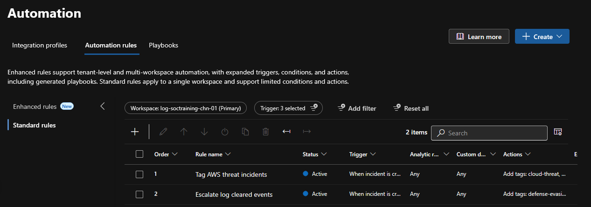
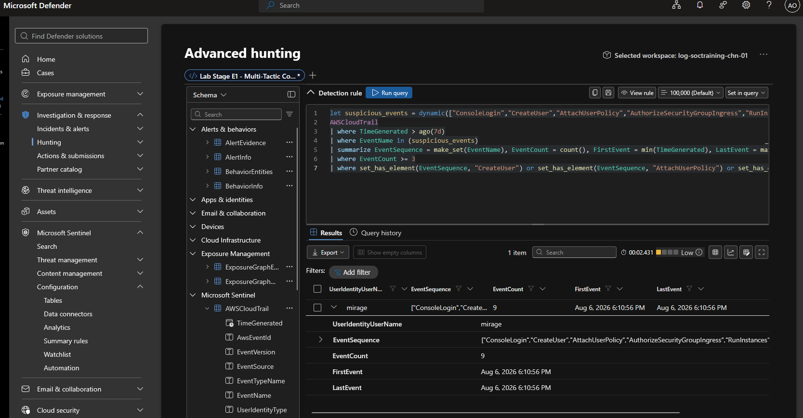
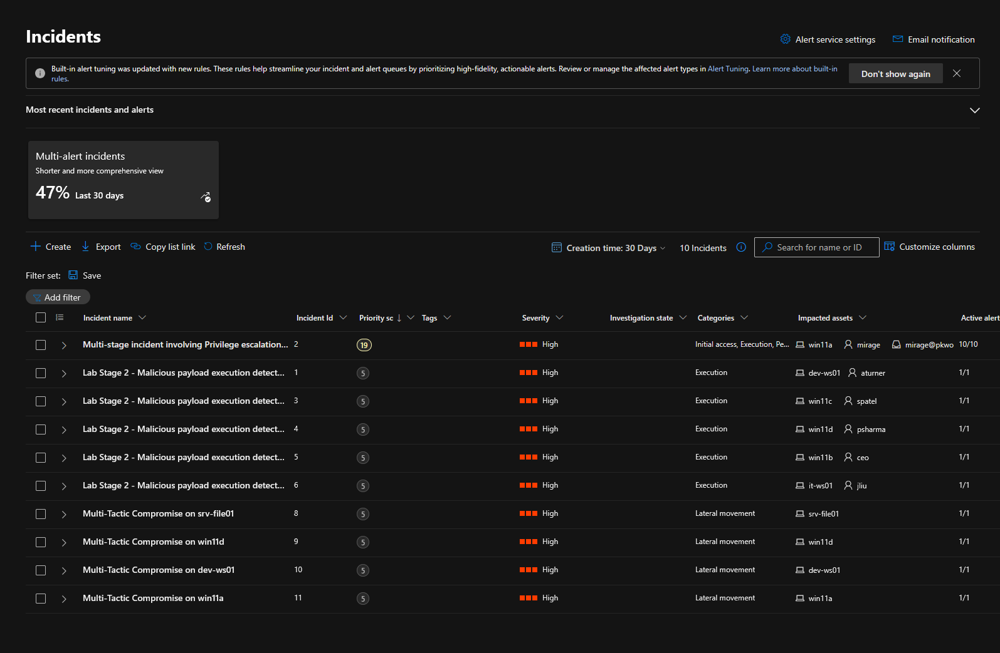

# Module 2, Exercise 4 — Automation Rules

**SC-200 domain:** Manage a security operations environment (40–45%) — automation rules named explicitly.
**Prerequisites:** Exercises 1–3 complete.

---

## Summary

Built two Sentinel automation rules to auto-tag and escalate incidents on title-matching conditions. Discovered mid-exercise that this environment has **zero native Sentinel analytics rules** — every real detection is a Defender XDR custom detection rule instead, which uses different automation-rule condition fields than the exercise's own scenario assumed. Further discovered that all 20 deployed detection rules' short `ago()` lookback windows have aged out against the now nearly-week-old fixed ingestion timestamp, meaning no rule can currently produce a fresh incident through its normal schedule or a manual run. Validated both the automation rules and the underlying detection logic independently — via the rules' exported ARM definitions and a deliberately widened test query — providing full confidence in both despite being unable to observe a live, end-to-end tagged incident.

## Errors Encountered and Resolved

**1. Exercise assumes native Sentinel analytics rules that don't exist in this environment.** The exercise's own reference note names specific analytics rules (`AWS Config Service Resource Deletion Attempts`, `NRT Security Event log cleared`, etc.) as automation-condition targets. Confirmed directly:
```bash
az resource list --resource-group rg-soctraining-chn-01 --resource-type "Microsoft.SecurityInsights/alertRules"
```
Returned empty — no native analytics rules were ever deployed here. Every working detection is a Defender XDR custom detection rule (Graph API-based), a structurally different resource type with different automation-condition field support.

**2. Adapted conditions to `IncidentTitle` instead of `Analytic rule name`.** Confirmed correct via each rule's exported ARM JSON. `Analytic rule name` only ever populates for native analytics-rule-sourced incidents. `Lab Stage 8 - Backdoor Account Login from Creator IP (AWS)` substituted for the exercise's non-existent "Security Event log cleared" scenario — closest thematic match (defense-evasion/persistence via backdoor account access); tags adjusted to `defense-evasion` + `persistence`, dropping `log-tampering` since it doesn't genuinely apply to the substitute.

**3. Rule 1 initially targeted the wrong field.** First configuration used `Incident description contains "AWS"` rather than `Incident title contains "AWS"`. Description is free text, not guaranteed to contain the same keywords the title reliably does. Corrected to Title.

**4. No tags appeared on existing incidents.** Both rules use `"triggersWhen": "Created"` — evaluated only against incidents created *after* the rule exists, never retroactively. All visible incidents predated rule creation by days.

**5. Manually running the target detection rules produced no new incidents at all — root cause traced to the actual deployed query.** A fresh incidents export confirmed zero AWS- or Backdoor-related incidents exist anywhere in the queue's history, not just post-rule-creation. Pulled `Lab Stage 7`'s actual query and found: `where TimeGenerated > ago(2h)`. `TimeGenerated` was fixed at ingestion (6 August); this exercise ran on 12 August — nearly a week later, far outside a 2-hour window. Not specific to these four rules: every one of the 20 deployed detection rules has a similarly short, hardcoded window and is equally unable to fire via its normal schedule or manual Run at this point in the project.

**Validated the detection logic was never actually broken:** re-ran `Lab Stage 7`'s exact query with the window widened to `ago(7d)` directly in Advanced Hunting. Returned a clean, complete match — AWS IAM user `mirage` (the same account central to Onboarding's multi-stage incident) with 9 events including `CreateUser`, `AttachUserPolicy`, and `StopLogging` — exactly the pattern the rule targets. Confirms the rule's logic and the underlying telemetry are both sound; only the fixed short window was ever the problem.

## Technical Know-How

> **Automation rule condition fields depend on incident source.** `Analytic rule name` is scoped to Sentinel-native analytics rules and won't match Defender-XDR-custom-detection-sourced incidents — use `Incident title` (or description, with caution) instead. Check which detection mechanism a workspace actually uses before assuming a condition field will match anything.

> **Static demo telemetry with a fixed ingestion timestamp has a shelf life against any `ago()`-windowed rule.** Once real elapsed time exceeds the window, the rule goes structurally silent — no error, just quietly stops matching — until the window is widened or the data refreshed. A genuine operational point beyond this lab: relative-time windows assume continuously arriving data, an assumption static test datasets violate the moment enough real time passes.

> **When live end-to-end testing is blocked by something environmental rather than a configuration flaw, validate the pieces independently instead.** Configuration correctness via the resource's exported ARM definition, detection logic correctness via a deliberately widened test query — together, equivalent confidence to a live fire.

## Key Learnings

- Check whether a target workspace actually has the rule type an exercise assumes (native analytics rules vs. custom detection rules) before building conditions around specific field names.
- `triggersWhen: Created` automation rules are never retroactive — test only against incidents created after the rule exists.
- A rule that "should have fired but didn't" deserves inspecting its actual query before assuming misconfiguration.
- Exporting a resource's ARM template is a fast, authoritative way to confirm exactly what got configured, independent of what the portal UI displays.

## Screenshots referenced

- `automation_rules_list` — both rules listed in Configuration → Automation

	

- `automation_rule_json_export` — exported ARM JSON, used to confirm correct configuration

	[Azure_Sentinel_automation_rules.json](../../JSON_files/Azure_Sentinel_automation_rules.json)

- `lab_stage7_widened_window_match` — the `ago(7d)` query result showing the `mirage` match

	

- `incidents_queue_no_new_incidents` — queue export showing no new AWS/Backdoor incidents despite manual runs

	

---

**Deliverable status:** Complete.
