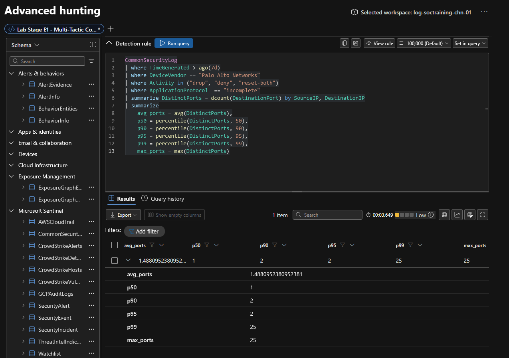
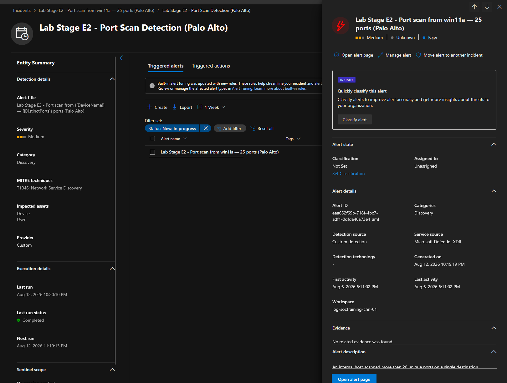

# Module 2, Exercise 6 — Port Scan Detection & Threshold Tuning
 
**SC-200 domain:** Manage a security operations environment (40–45%) — alert tuning named explicitly in the current outline; reinforces T1046 (Network Service Discovery) from Exercise 3's MITRE matrix.
**Rule:** `Lab Stage E2 - Port Scan Detection (Palo Alto)`
**Prerequisites:** Exercises 1–4 complete (Exercise 5 skipped, not applicable).
 
---
 
## Summary
 
Established a baseline of normal vs. anomalous port-scan diversity from ingested Palo Alto firewall telemetry, then tuned `Lab Stage E2`'s detection query with a threshold chosen from that baseline rather than the exercise's generic default. Both the baseline and tuned-rule queries needed their `ago()` windows widened up front — same staleness issue identified in Exercise 4, addressed proactively this time before running anything rather than after hitting empty results.
 
## Errors Encountered and Resolved
 
**1. Both queries' default lookback windows were already known to be stale.** Step 1's baseline and Step 2's tuned rule were both widened to `ago(7d)` before running.
 
**2. The exercise's generic threshold-selection formula didn't fit this dataset's actual distribution.** Baseline results: `p50=1`, `p90=2`, `p95=2`, `p99=25`, `max_ports=25`. The exercise's table says "p99 above 20 → use p99 + 20%," which would set the threshold to ~30 — but `p99` and `max_ports` are identical here, meaning nothing in the dataset has ever exceeded 25. A threshold of 30 would have excluded the only genuine scan activity present, not reduced noise.
 
   **Root cause:** the formula assumes a continuous tail distribution above p99. This dataset's actual shape is different — a large cluster of flat, normal 1–2-port activity, then one clear outlier sitting right at the maximum, with nothing graduated in between. That's consistent with the dataset containing essentially one synthetic attack scenario rather than a population of graduated scanning behavior. Percentile-based tuning assumes the latter; this data has the former.
 
   **Resolution:** selected `> 10` instead — roughly 5× the genuine baseline ceiling (meaningful separation from normal traffic), while staying well below the actual attack's 25 distinct ports (safe margin so the real scan still fires, plus headroom for a quieter version of the same pattern).
 
## Technical Know-How
 
> **Percentile-based threshold tuning assumes a continuous tail distribution — check for that assumption before applying a generic formula.** When `p99` equals `max_ports`, there's no tail to measure; the "outlier" isn't statistically rare within a spectrum, it's simply the one attack in an otherwise flat dataset. Formulas built for large, continuously-varying production traffic don't map cleanly onto small, scenario-based synthetic datasets — always look at the shape of the actual numbers, not just where they'd plug into a table.
 
> **Threshold selection is a trade-off between two failure directions, not a single "correct" number.** Too low: normal variance in legitimate multi-port services trips the rule. Too high: the actual attack stops being distinguishable from noise, or worse, falls below the threshold entirely. The right number sits in whatever gap separates genuine baseline behavior from genuine attack behavior — here, a wide and forgiving gap (2 vs. 25) made this an easy call; a narrower gap in a real environment would demand much more caution.
 
## Key Learnings
 
- Always inspect the actual shape of a baseline distribution (not just the summary percentiles) before applying a generic tuning formula — a formula's assumptions can silently not hold.
- `p99 == max_ports` is a strong signal the dataset lacks a graduated tail — treat percentile-based guidance cautiously in that case.
- Widening a stale `ago()` window proactively (informed by a prior exercise's finding) is faster and cleaner than discovering it via an empty result — worth carrying the lesson forward explicitly rather than re-diagnosing it each time.
## Screenshots referenced
 
- Step 1 baseline query result (avg/p50/p90/p95/p99/max_ports)

- Step 3 validation, tuned rule (`> 10`) producing real results

---
 
**Deliverable status:** Complete.
 
