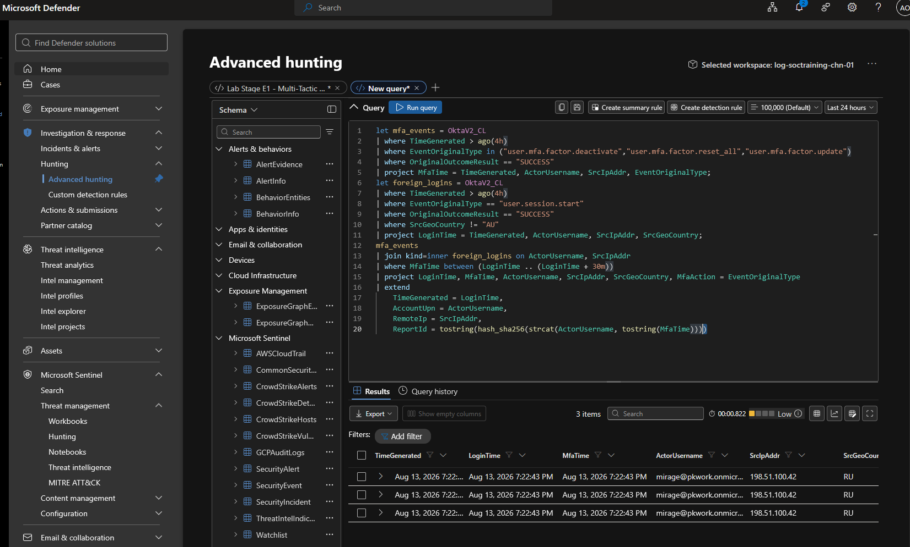
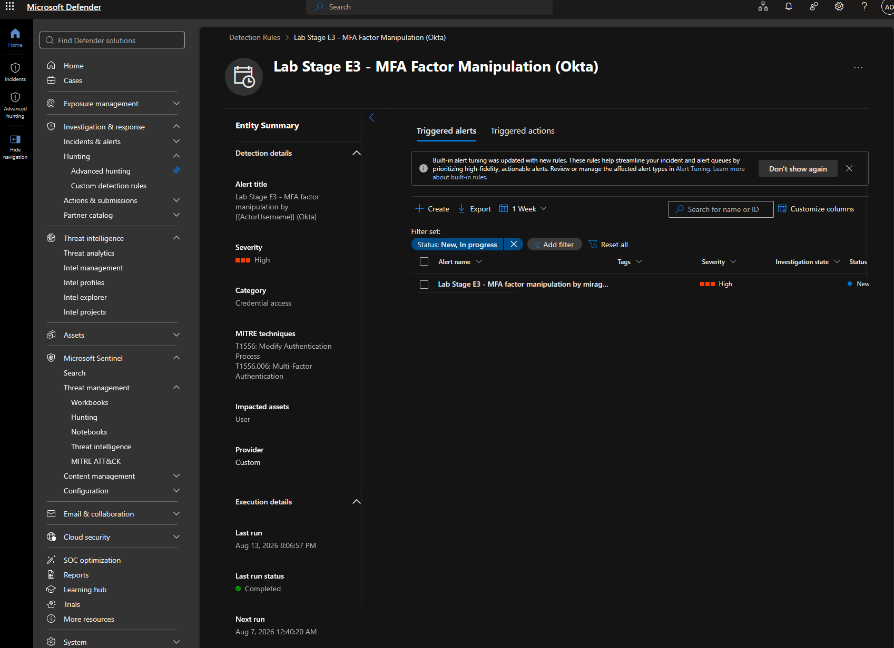

# Module 2, Exercise 7 — Okta MFA Factor Manipulation

**SC-200 domain:** Perform threat hunting (20–25%) — identity-centric correlation query; Manage a security operations environment (40–45%) — custom detection rule editing and enabling.
**Rule:** `Lab Stage E3 - MFA Factor Manipulation (Okta)`
**Prerequisites:** Exercises 1–4, 6 complete (Exercise 5 skipped).

---

## Summary

Re-ingested fresh telemetry to obtain MFA factor-manipulation events, which were absent from the original Onboarding ingestion by design (per the packaged rule's own description). Verified the events landed, reviewed the deployed rule's simple filter, built and validated a higher-fidelity correlation query linking a foreign-origin login to a subsequent MFA change within a 30-minute window, and enabled the previously disabled-by-design rule with the correlated version.

## Errors Encountered and Resolved

**1. MFA manipulation events absent from original ingestion — by design, not a bug.** Documented directly in the packaged rule's own description: these events were added to the attack scenario generator after the project's original ingestion. Resolved by re-running `RunIngest.ps1`. Notably clean this time — the RG-scope RBAC grant from Onboarding (§00, Errors 4.3) was already active and long since propagated, so this re-ingestion completed with none of the earlier `403`/propagation-delay friction. Direct payoff from choosing the broader grant scope back then rather than sticking with narrower per-DCR grants.

**2. The exercise's own published correlation query had a KQL syntax issue.** As provided:
```kql
| where MfaTime between (LoginTime .. LoginTime + 30m)
```
This failed to run. Fixed by explicitly parenthesizing the upper-bound expression:
```kql
| where MfaTime between (LoginTime .. (LoginTime + 30m))
```

## Technical Know-How

> **KQL's `between` operator can require explicit parenthesization of a compound upper-bound expression.** `LoginTime .. LoginTime + 30m` is ambiguous enough between the range operator (`..`) and arithmetic (`+`) that it needs the arithmetic wrapped in its own parentheses to parse reliably — write `(LoginTime .. (LoginTime + 30m))` rather than relying on implicit precedence.

> **Time-windowed correlation between two distinct identity event types is materially higher-fidelity than either alone.** "An MFA change happened" is weak — could be legitimate self-service. "An MFA change happened within 30 minutes of a login from an unexpected country" is a strong post-compromise-persistence signal. This is a general, reusable identity-detection pattern, not specific to Okta.

## Key Learnings

- Don't assume packaged/reference KQL is guaranteed to run as published — verify live, the same discipline already applied to this module's other content bugs.
- Re-ingesting telemetry becomes low-cost once broad-scope RBAC is already established — a concrete return on the Onboarding-stage decision to grant at resource-group scope.
- Correlating two individually-weak identity signals within a tight time window is a pattern worth remembering generally, well beyond this one exercise.

## Screenshots referenced

- Step 3, correlated query result (foreign login → MFA change within 30 minutes)



- Step 4, rule enabled and firing with correct entity mapping



---

**Deliverable status:** Complete.