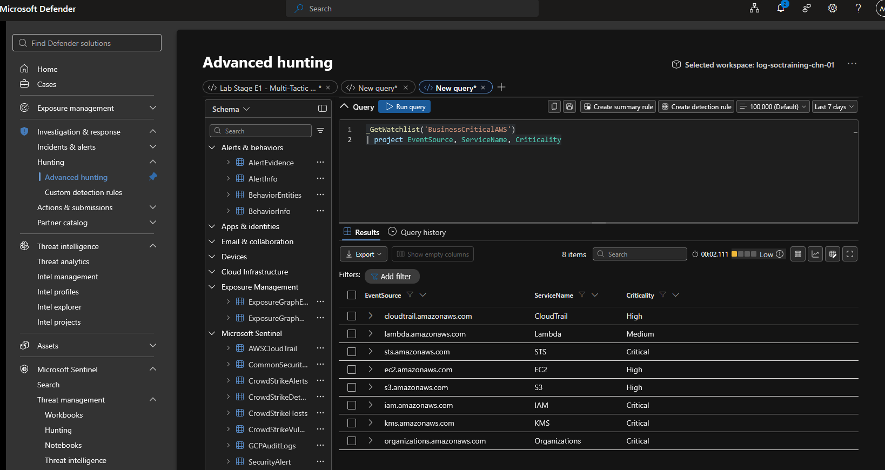
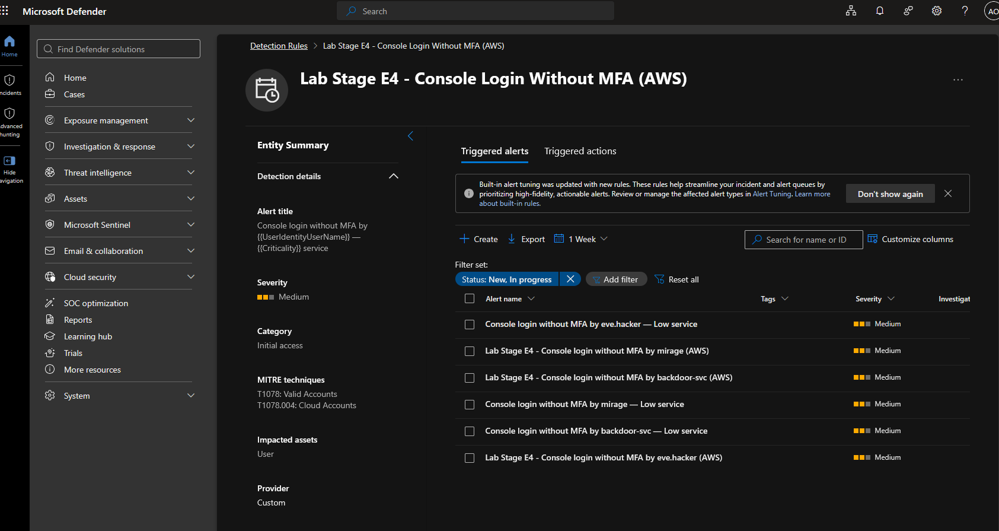
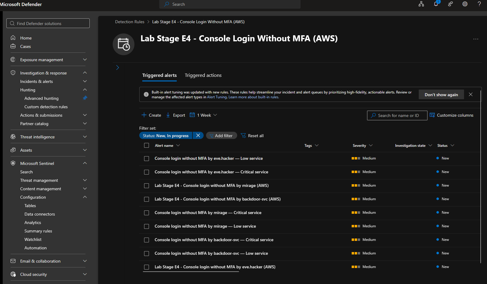

# Module 2, Exercise 8 — Watchlist Integration

**SC-200 domain:** Manage a security operations environment (40–45%) — watchlists and alert enrichment.
**Rule:** `Lab Stage E4 - Console Login Without MFA (AWS)`
**Prerequisites:** Exercises 1–4, 6–7 complete (Exercise 5 skipped).

---

## Summary

Created and uploaded a `BusinessCriticalAWS` watchlist mapping AWS event sources to business-criticality levels, then modified the (previously disabled-by-design) `Lab Stage E4` rule to enrich non-MFA console logins via `_GetWatchlist()` and a `lookup kind=leftouter` join. The rule fired and the custom alert-title template worked on the first pass, but enrichment itself was silently failing — every alert showed the `coalesce()` fallback (`"Low"`) rather than a real criticality value. Traced to a genuine gap in the exercise's own sample watchlist data, fixed by adding the missing event source, and confirmed working with real `Critical` values appearing on rerun.

## Errors Encountered and Resolved

**1. Watchlist enrichment silently defaulted to "Low" for every alert — rule looked done, but wasn't.** All three initial alerts (`eve.hacker`, `mirage`, `backdoor-svc`) showed `— Low service` in the title, the `coalesce()` fallback rather than a real match. The rule fired correctly, the title template worked, entities mapped correctly — everything *looked* complete, which is exactly what made this worth catching rather than assuming done.

   **Root cause, confirmed via direct query:**
   ```kql
   AWSCloudTrail
   | where EventName == "ConsoleLogin"
   | distinct EventSource
   ```
   Returned `signin.amazonaws.com` — not present anywhere in the exercise's own provided 8-row watchlist CSV (`iam`, `s3`, `ec2`, `lambda`, `kms`, `sts`, `organizations`, `cloudtrail`). The one event source the rule actually needs to match — the literal sign-in event — was missing from the reference data meant to enrich it.

   **Fix:** added a 9th row (`signin.amazonaws.com,Sign-In,Critical`) and re-uploaded via the watchlist's in-place **Update** flow (no need to delete and recreate). Reran the rule — new alerts correctly showed `— Critical service`.

## Technical Know-How

> **Watchlist-based enrichment is only as good as the watchlist's coverage of the field values actually present in live data.** A reference dataset provided as part of an exercise or template isn't guaranteed complete — verify the enrichment key's real distinct values against the source table (`distinct EventSource` here) before trusting a join to work.

> **`coalesce()` defaults can mask an enrichment failure as if it were legitimate output.** A rule that silently falls back to `"Low"`/`"Unknown"` keeps firing and looks finished even when the join is contributing nothing at all. Always check the actual value distribution of enriched fields, not just that the rule runs without error — "it ran" and "it worked" are different claims.

> **Sentinel watchlists support in-place updates**, not just delete-and-recreate — useful for exactly this kind of iterative tuning.

## Key Learnings

- Don't trust a provided reference watchlist to be complete for the live field it's meant to enrich — verify with a `distinct()` query first, every time.
- When using `coalesce()` defaults, actively check whether real values are coming through, not just that the query executes cleanly.
- A "successful-looking" first pass is worth a second look when the enrichment is the actual point of the exercise, not just the rule firing.

## Screenshots referenced

- Step 3, watchlist confirmed queryable via `_GetWatchlist()`



- Step 6, first rule run — alerts firing correctly, but showing the `"Low"` fallback (the issue, captured in the process)



- post-fix rerun, showing both the earlier `"Low"` alerts and the corrected `"Critical"` alerts side by side for the same users



---

**Deliverable status:** Complete.