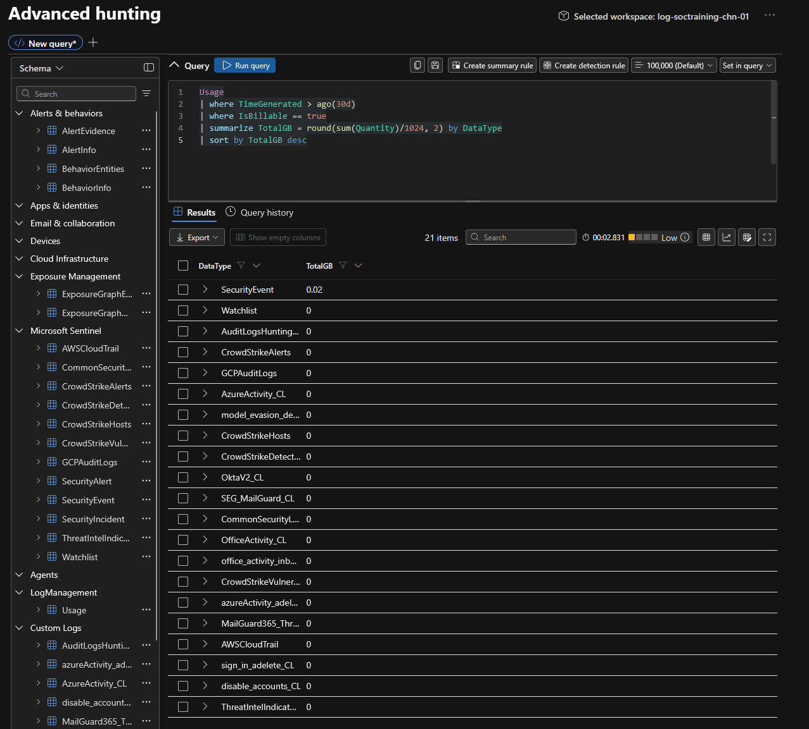
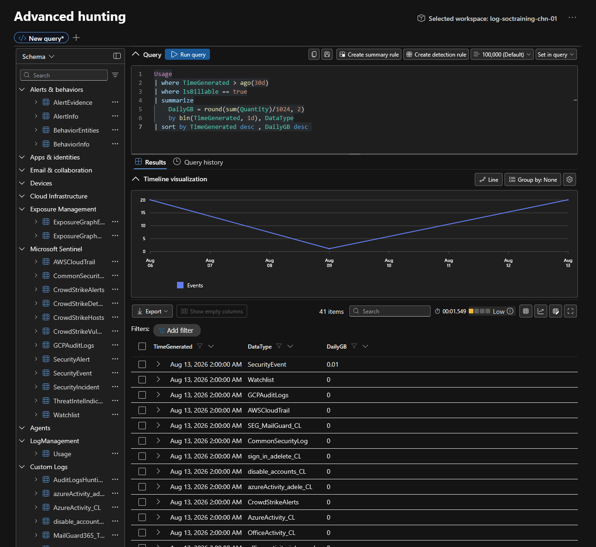
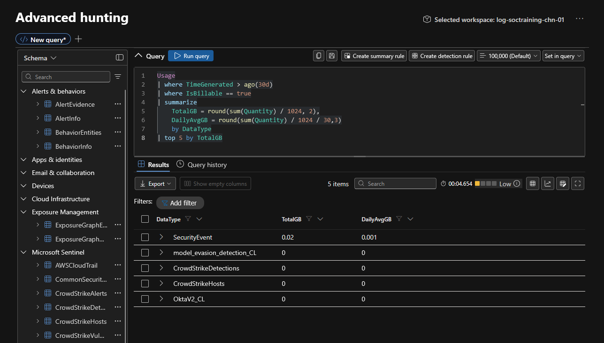
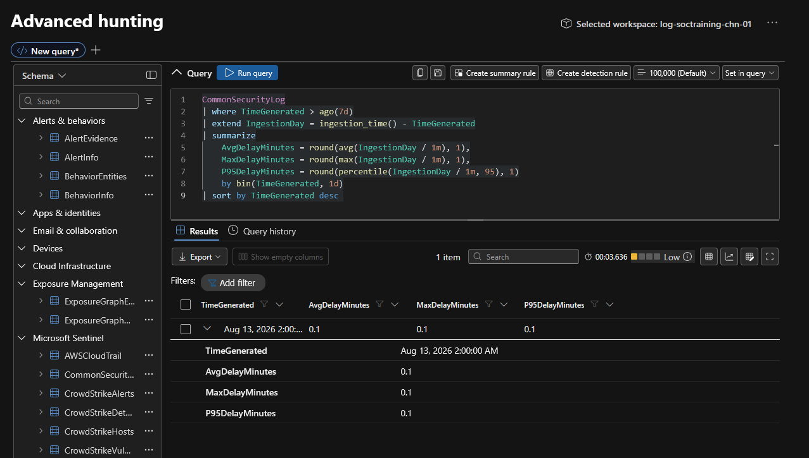
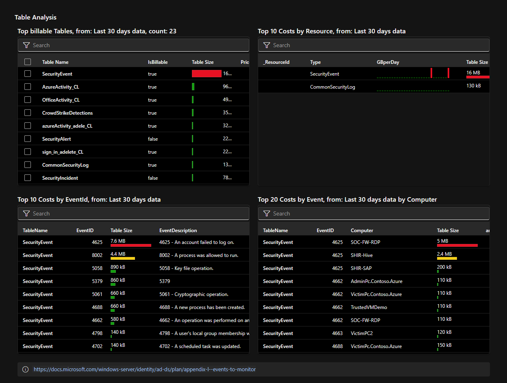
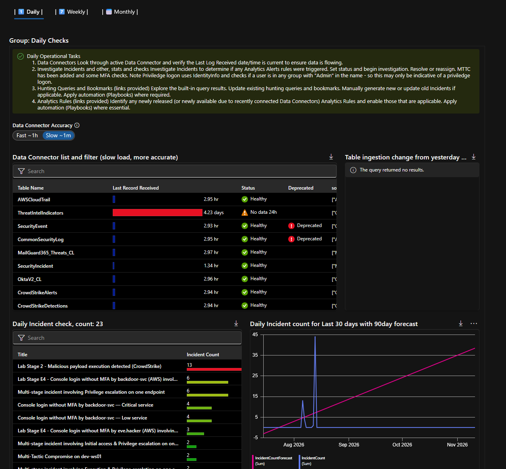
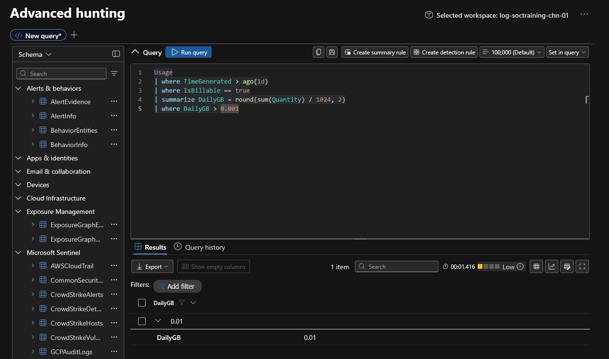

# Module 2, Exercise 9 — Cost Management & Ingestion Analysis

**SC-200 domain:** Manage a security operations environment (40–45%) — SOC optimization and workspace cost/retention management.
**Prerequisites:** Exercises 1–4, 6–8 complete (Exercise 5 skipped).

---

## Summary

Queried the `Usage` table to analyze ingestion volume by table and by day over the project's lifetime, identified top cost drivers, checked ingestion latency, and reviewed both the Cost management page and the Workspace Usage Report workbook.

## Adaptations

**Step 6's ingestion-alert threshold scaled down for lab reality.** As published, the query flags days where billable ingestion exceeds `5` GB. This workspace's entire ingestion history totals a small fraction of that — the threshold would never fire in this environment. Adapted to `> 0.001` (roughly 1 MB/day) so the alert logic is actually meaningful at this scale:
```kql
Usage
| where TimeGenerated > ago(1d)
| where IsBillable == true
| summarize DailyGB = round(sum(Quantity) / 1024, 2)
| where DailyGB > 0.001
```
Query validated; the optional follow-up step of turning this into a saved Sentinel analytics rule was not pursued, consistent with Step 6 being explicitly marked optional in the source material.

## Technical Know-How

> **Monitoring thresholds — cost or security — need calibration against the environment's actual observed scale, not a generic production default.** The same principle from Exercise 6's percentile-based detection tuning applies directly here: a `5 GB/day` cost alert is meaningless noise-suppression in a workspace that's never approached that volume, exactly as a percentile formula built for large continuous production traffic didn't map onto Exercise 6's small synthetic dataset.

> **`Usage` and `ingestion_time()` are real, live system telemetry — safe to query with published `ago()` windows unmodified**, unlike the lab's own synthetic CSV-sourced tables. Worth explicitly distinguishing "genuine continuously-generated Azure Monitor data" from "lab-injected data with a frozen ingestion timestamp" — the staleness problem that recurred through Exercises 4, 6, and 7 was specific to the latter category, not a general property of every table in the workspace.

## Key Learnings

- Calibrate any threshold — detection or cost — against the environment's real observed data, never a textbook default, before trusting it to mean anything.
- Distinguish system-generated tables (`Usage`, ingestion metadata) from lab-injected synthetic tables when reasoning about whether a time window needs adjustment — they behave fundamentally differently.
- The daily ingestion breakdown (Step 1) is a genuine, if incidental, timeline of this whole project's data operations — Onboarding's ingestion and Exercise 7's re-ingestion should both be visible as spikes against otherwise flat days.

## Screenshots referenced

- Step 1, 30-day total by table



- Step 1, daily breakdown by table



- Step 2



- Step 3



- Step 4, Cost Analysis / Table Analysis tab



- Step 4, Regular Checks (D/W/M) tab



- Step 6, adapted threshold query and result



---

**Deliverable status:** Complete.