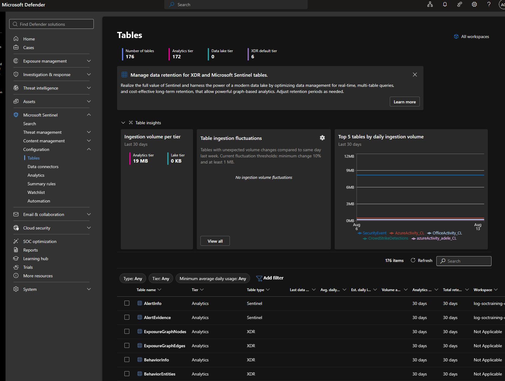
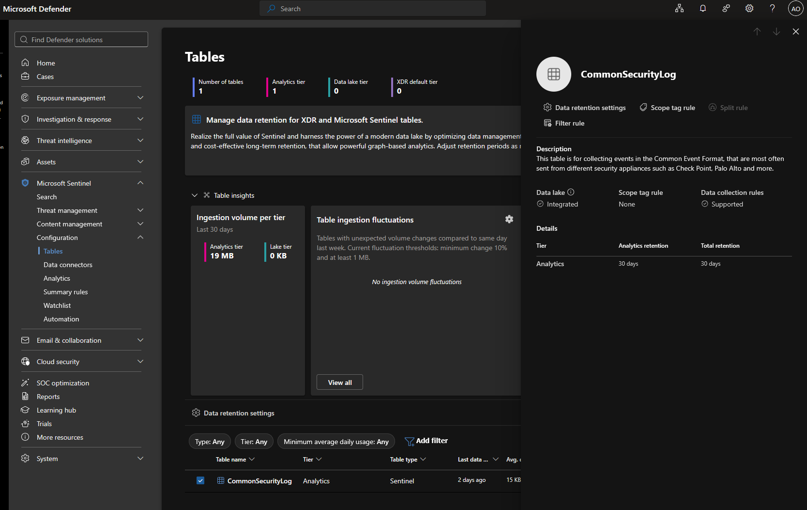
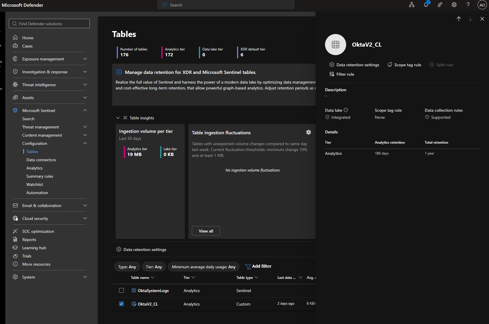

# Module 2, Exercise 10 — Table Management: Tiers & Retention

**SC-200 domain:** Manage a security operations environment (40–45%) — "retention across Analytics/Data lake/XDR tiers" is explicitly named as new material in the current outline.
**Prerequisites:** Exercises 1–4, 6–9 complete (Exercise 5 skipped).

---

## Summary

Explored table management in the Defender portal: viewed the full Tables list, inspected `CommonSecurityLog`'s default retention settings, and extended `OktaV2_CL`'s analytics retention to 180 days. Steps 4–5 (switching a table between Analytics and Data lake tiers) deferred, consistent with the project's standing decision to hold Data Lake work for Module 12 — the same deferral already applied to the `S8`/`E7` detection rules and Exercise 5's MDE requirement.

## Notes on live state

- `PaloAlto_ThreatSummary_KQL_CL`, listed in the exercise's own reference table, correctly did not appear in the actual Tables list — it's the output of a KQL job from Exercise 11, not yet built. Expected absence, not an error.

## Technical Know-How

> **Microsoft Sentinel solution tables (`CommonSecurityLog`, `SecurityEvent`, etc.) receive 90 days of analytics retention free by default; XDR tables receive 30 days included in the XDR license.** Extending beyond these defaults incurs a prorated long-term retention charge — worth knowing before assuming additional retention is free.

> **Total retention and analytics retention are independent settings.** Analytics retention (30 days – 2 years) controls how long data stays "hot" and queryable in real time; total retention (up to 12 years) extends a table's lifespan into the much cheaper data lake tier beyond that. By default, total retention matches analytics retention unless explicitly extended further.

> **Not every table needs analytics-tier residency.** Tables used primarily for compliance/audit trails rather than real-time detection (the exercise names `OfficeActivity_CL` as a candidate) are reasonable data-lake-tier candidates — but only once confirmed no active detection rule, analytics rule, or workbook depends on them. Step 6 demonstrates this directly against this project's own rules: `Lab Stage 3.5` and `Lab Stage 6` both require `CommonSecurityLog` to remain in the Analytics tier.

## Key Learnings

- Retention and tier are two separate levers — extending retention doesn't require moving tiers, and moving tiers is a much bigger decision (breaks real-time features entirely) than adjusting retention.
- Before changing any table's tier in a real environment, audit which detection rules/workbooks depend on it first — never assume a table is safe to move without checking.
- A table missing from the Tables list isn't necessarily a problem — it may simply not exist yet, pending an upstream step (KQL job, connector) that hasn't run.

## Screenshots referenced

- Step 1, full Tables list

- Step 2, current tier/retention settings

- Step 3, analytics retention extended to 180 days

---

**Deliverable status:** Complete.