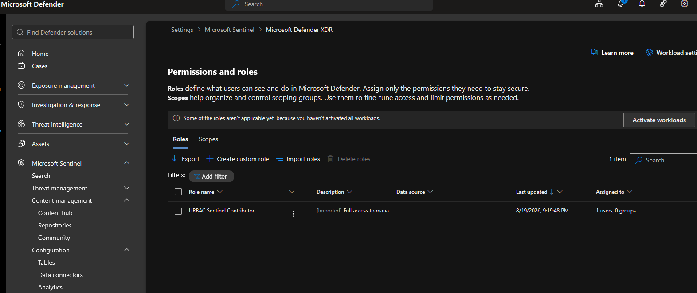

# Module 03 — Workspace, Roles & Retention

**SC-200 Domain:** Manage a security operations environment (40–45%)
**Phase:** B — P3: KQL Detection Library (Weeks 3–5)
**Status:** Complete, live-verified via Portal + CLI

---

## Overview

This module stands up the persistent portfolio workspace — `log-soc-chn-01` in `rg-soc-chn-01`, Switzerland North — that stays alive through Week 12. It's distinct from Module 02's disposable training-lab resource group, which is on a 30-day trial clock and gets deleted separately.

Four things get built and verified here: the workspace itself, a daily ingestion cap (set before anything else touches the workspace), Sentinel roles under both the classic Azure RBAC model and the newer Unified RBAC (URBAC) model, and a review of data retention across tiers plus the SOC optimization blade.

---

## Part 1 — Resource Group and Workspace

1. Created resource group `rg-soc-chn-01` in **Switzerland North**.
2. Created Log Analytics workspace `log-soc-chn-01` in that resource group, same region, Pay-as-you-go pricing tier.

**Screenshot:** `log-soc-chn-01-workspace-overview-portal`

> 💡 **Technical Know-How** — A Microsoft Sentinel workspace *is* a Log Analytics workspace with Sentinel enabled on top. There's no separate "Sentinel resource" to provision independently; Sentinel is added to an existing Log Analytics workspace.

### CLI verification

```bash
az group show --name rg-soc-chn-01 --output table
```

```
Location          Name
----------------  -------------
switzerlandnorth  rg-soc-chn-01
```

```bash
az monitor log-analytics workspace show \
  --resource-group rg-soc-chn-01 --workspace-name log-soc-chn-01 \
  --output table
```

Confirmed: `ProvisioningState: Succeeded`, `Location: switzerlandnorth`, `RetentionInDays: 30`.

---

## Part 2 — Daily Ingestion Cap

Set the daily ingestion cap on the workspace **before** adding Sentinel or any data connector, per project budget guardrails.

- **Path:** `log-soc-chn-01` -> Usage and estimated costs -> Data Cap
- **Final value:** 0.5 GB/day (500 MB)

> 💡 **Technical Know-How** — The Azure Monitor daily cap accepts values as low as 0.023 GB. It's a safety backstop against runaway ingestion, not a cost-optimization tool in itself — Microsoft's own guidance is explicit that the cap shouldn't be relied on as a primary mechanism to reduce costs, only to prevent unexpected spikes. In a region like Switzerland North, where pay-as-you-go Sentinel ingestion runs roughly double the US baseline rate, the cap's ceiling matters more than in cheaper regions.

### CLI verification

```bash
az monitor log-analytics workspace show \
  --resource-group rg-soc-chn-01 --workspace-name log-soc-chn-01 \
  --query "workspaceCapping" --output yaml
```

```yaml
dailyQuotaGb: 0.5
dataIngestionStatus: RespectQuota
quotaNextResetTime: '2026-08-20T08:00:00Z'
```

---

## Part 3 — Onboarding to the Defender Portal

As of this module, Microsoft Sentinel management for this project happens exclusively through `security.microsoft.com` — the classic Azure portal Sentinel blade is being phased out, and new Sentinel customers (which this workspace counts as) are auto-onboarded to the Defender portal.

1. Added Sentinel to `log-soc-chn-01` via the Azure portal (Microsoft Sentinel -> Create -> select workspace -> Add).
2. Connected the workspace in the Defender portal: System -> Settings -> Microsoft Sentinel -> Connect a workspace. As the only workspace in the tenant, it was automatically designated the **primary workspace**.

### CLI verification

No dedicated Azure CLI command exists for Sentinel onboarding state — verified via `az rest` against the underlying resource provider instead:

```bash
az rest --method get \
  --url "https://management.azure.com/subscriptions/<YOUR-SUBSCRIPTION-ID>/resourceGroups/rg-soc-chn-01/providers/Microsoft.OperationalInsights/workspaces/log-soc-chn-01/providers/Microsoft.SecurityInsights/onboardingStates/default?api-version=2023-11-01" \
  --output yaml
```

```yaml
id: /subscriptions/<YOUR-SUBSCRIPTION-ID>/resourceGroups/rg-soc-chn-01/providers/Microsoft.OperationalInsights/workspaces/log-soc-chn-01/providers/Microsoft.SecurityInsights/onboardingStates/default
name: default
properties: {}
systemData: {}
type: Microsoft.SecurityInsights/onboardingStates
```

> 💡 **Technical Know-How** — The presence of this resource (a 200 response with populated `id`/`name`/`type`) is itself the onboarding confirmation — a workspace not onboarded to Sentinel returns a 404 here instead. An empty `properties: {}` object is normal and expected; it only populates fields like `customerManagedKey` when those are explicitly configured, which they aren't in this deployment.

---

## Part 4 — Roles: Classic Azure RBAC and Unified RBAC

Sentinel access control currently spans **two independent permission systems** that this module deliberately exercised both of:

- **Classic Azure RBAC** — the long-standing model: Reader / Responder / Contributor, assigned via Azure IAM, scoped to a subscription, resource group, or the workspace resource itself.
- **Unified RBAC (URBAC)** — reached general availability in the Defender portal in May 2026, alongside row-level data scoping. It replaces the coarse workspace-level model with granular permission groups (Security operations / Security data basic, Alerts, Response; Authorization and settings / Detection tuning) assignable across the whole Defender workload, not just Sentinel.

### Classic Azure RBAC

Assigned **Microsoft Sentinel Contributor** at the `rg-soc-chn-01` resource group scope (not the workspace) — the Microsoft-recommended scope, specifically because Logic Apps and playbooks deployed into the same resource group later (Module 08) inherit the same role assignment automatically, rather than needing a separate grant.


### Unified RBAC

Used the Defender portal's **role import** feature rather than building a custom URBAC role from scratch: Permissions -> Microsoft Defender XDR -> Roles -> Import roles -> selected Microsoft Sentinel -> produced a role named **"URBAC Sentinel Contributor"**, imported and auto-mapped to the equivalent classic role.

**Screenshot:** `defender-xdr-urbac-sentinel-contributor-import-portal`



> 💡 **Technical Know-How** — Role assignments in classic Azure RBAC are **cumulative and additive**. Holding both Reader and Contributor on the same scope doesn't create a conflict or an intersection — it resolves to the broader permission set (Contributor), since Contributor is already a superset of Reader. This is a common real-world misconfiguration: granting a narrower role "on top of" a broader one accomplishes nothing and can obscure what a user's actual effective access is meant to be. Least-privilege design means assigning *only* the narrowest role that covers the job, not stacking roles defensively.

> 💡 **Technical Know-How** — URBAC role mapping to classic roles: **Sentinel Reader** -> Security operations / Security data basic (read). **Sentinel Responder** -> adds Alerts (manage) + Response (manage). **Sentinel Contributor** -> adds Authorization and settings / Detection tuning (manage) on top of Responder. Three classic roles — Playbook Operator, Automation Contributor, Workbook Contributor — are **not yet supported in URBAC** and must still be managed in Azure RBAC; this matters directly for Module 08 (Logic App playbooks).

> 💡 **Technical Know-How** — URBAC lives entirely in the Defender permission model, separate from Azure Resource Manager. `az role assignment list` and other Azure CLI RBAC commands **cannot see URBAC roles at all** — there's no CLI equivalent for verifying them. Portal screenshots are the only verification artifact for this half of the access model.

### CLI verification (classic RBAC only)

```bash
az role assignment list --resource-group rg-soc-chn-01 --include-inherited --output table
```

```
Principal        Role                                          Scope
----------------  --------------------------------------------  -------------------------------------------------------
Ahmed Othman      Owner                                         /subscriptions/<YOUR-SUBSCRIPTION-ID>
Ahmed Othman      Security Admin                                /providers/Microsoft.Management/managementGroups/<ID>
Ahmed Othman      Microsoft Sentinel Contributor                /subscriptions/<YOUR-SUBSCRIPTION-ID>/resourceGroups/rg-soc-chn-01
```

Owner (inherited from the subscription) and Security Admin (inherited from the management group) are Azure for Students subscription defaults, not manually configured — they already granted functional access, which is why the resource-group-scoped Sentinel Contributor assignment was still worth doing explicitly as a demonstrated least-privilege exercise, even though it wasn't strictly required for access.

---

## Part 5 — Retention Across Tiers

Reviewed table-level retention settings in the Defender portal at **Microsoft Sentinel -> Configuration -> Tables** (not under System -> Settings, where it might be expected).

Every table in the fresh workspace sits at the default: **Analytics tier, 30-day retention**, except for a small set of tables (`Usage`, `AzureActivity`, `AppRequests`, `AppTraces`, and other Application Insights–style tables) that default to 90 days. This matches Microsoft's documented default for the Analytics tier and confirms the workspace's retention configuration matches expectations without needing changes — the project's 30-day guardrail is already satisfied by the platform default for most tables.


> 💡 **Technical Know-How** — Sentinel retention has two layers, not one. **Analytics retention** ("hot," 90 days free by default, extensible to two years) keeps data queryable at full speed for alerting, hunting, and workbooks. **Total retention** extends beyond that into the **Data Lake tier** — a "cold" store, up to 12 years, where data is *not* available for real-time analytics or threat hunting but is still queryable via KQL jobs, scheduled Spark jobs, or summary rules. Analytics-tier data is automatically mirrored into the lake at no extra charge while it's within the analytics retention window; only the *extension* beyond that window incurs lake storage cost.

### CLI verification

```bash
az monitor log-analytics workspace table list \
  --resource-group rg-soc-chn-01 --workspace-name log-soc-chn-01 \
  --query "[].{Name:name, Plan:plan, RetentionDays:retentionInDays, TotalRetentionDays:totalRetentionInDays}" \
  --output table
```

Full output confirms all present tables at `Plan: Analytics`, `RetentionDays: 30` (standard tables) or `90` (Usage/AzureActivity/App* telemetry tables) — matches the portal exactly.

---

## Part 6 — SOC Optimization

Reviewed the **SOC optimization** blade in the Defender portal. On a fresh workspace with no connectors and no ingested data yet, recommendations were sparse-to-empty — expected, since the recommendation engine scans actual connector usage, analytics rule coverage, and data value against real telemetry, none of which exists yet. This baseline (empty state) is itself worth documenting, since Module 06 will revisit this blade once Module 04's connectors and Module 05's analytics rules are live, and the contrast is the point.

> 💡 **Technical Know-How** — SOC optimization surfaces two categories of recommendation: **data value recommendations** (suggesting a cheaper table plan for data that's rarely queried — e.g., moving a table from Analytics to the Data Lake tier) and **risk-based optimizations** (coverage gaps against specific threats, categorized by Operational, Financial, Reputational, Compliance, and Legal risk). "Cost optimization" isn't the formal category name Microsoft uses — "data value recommendation" is the term that shows up in the interface and in exam material.

---


## Key Learnings

- **URBAC and classic Azure RBAC are two separate systems that happen to interoperate, not one system with two names.** Importing a role into one does not create anything in the other. A complete access-control picture for a Sentinel workspace in 2026 requires checking both — and only one of them (classic RBAC) is inspectable via CLI.
- **RBAC accumulation is additive, not intersectional.** Assigning both a narrow and a broad role on the same scope doesn't restrict anything; the broader role always wins. Least privilege means picking the single right role, not stacking for safety.
- **Scope choice for a role assignment is a forward-looking decision, not just a right-now one.** RG-level vs. resource-level assignment only matters once something else (a playbook, in this project's case) gets deployed into the same resource group later — a decision made in Week 3 has consequences that don't surface until Week 7–8.
- **A daily ingestion cap is a budget decision as much as a technical one**, especially in a region priced well above the US baseline. Defaults and "reasonable-sounding" round numbers (1 GB) aren't automatically safe just because the platform accepts them.
- **CLI verification has blind spots that are worth naming explicitly** — inherited role assignments and URBAC roles are two concrete gaps encountered in this module alone. "The CLI said nothing was there" is not the same as "nothing is there."

---

**Next:** Module 04 — Data Connectors & Signal Estate